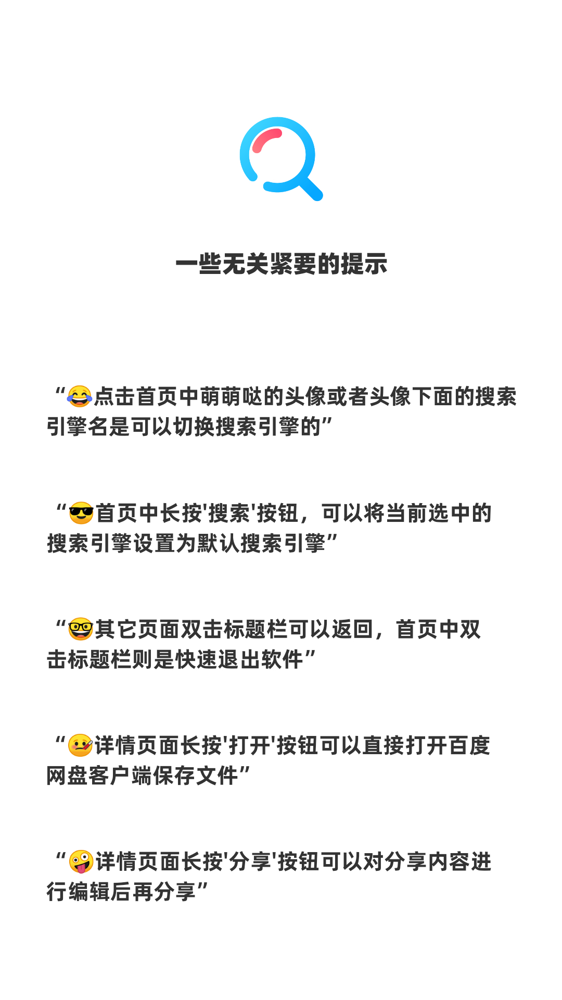
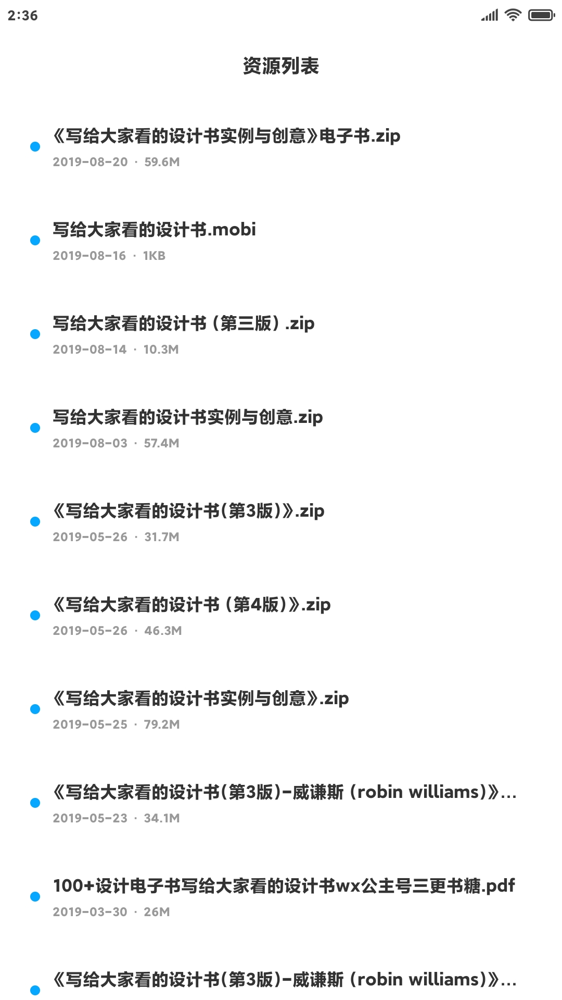
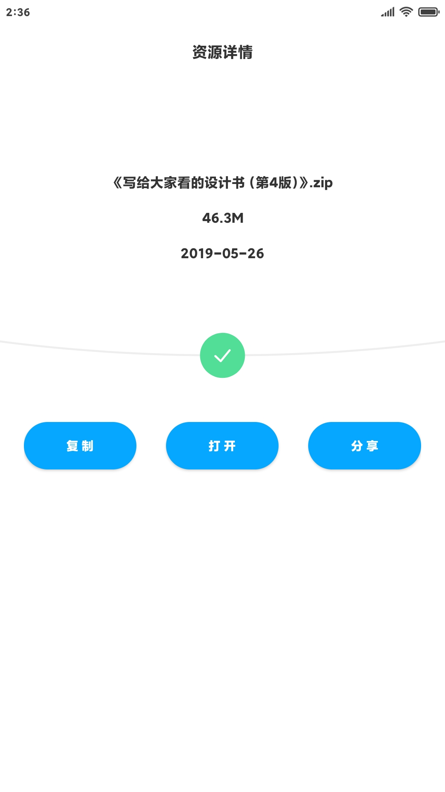
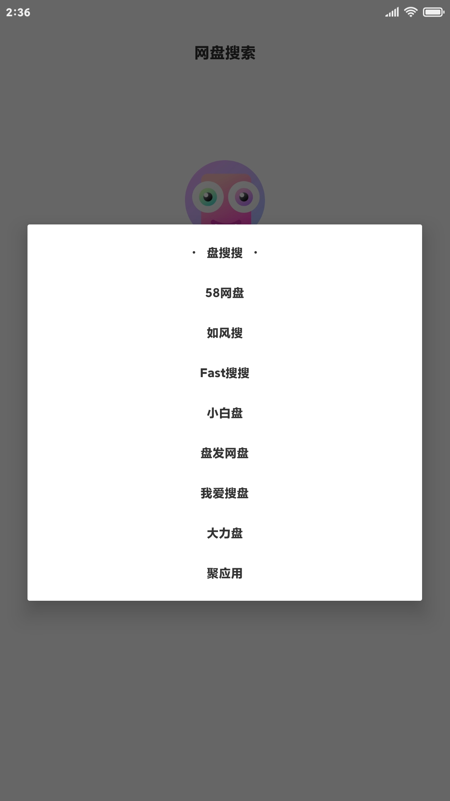

<h3 align="center">
  
   
   网盘搜索 
</h3>

## 最新版本
> v3.12.200305 [点击下载]( https://github.com/voidlhf/NetdiskSearcherForAndroid/releases/latest)
- 适配Android R
- 修复聚应用接口
 

## 项目说明
网盘搜索是一款搜索百度网盘资源的App，项目使用安卓端开发工具AIDE开发，AIDE可以直接打开该项目。如果需要转换成Android Studio项目，请自行转换。
 

## 使用提示
 

 

## 界面预览
 

 

 

 

